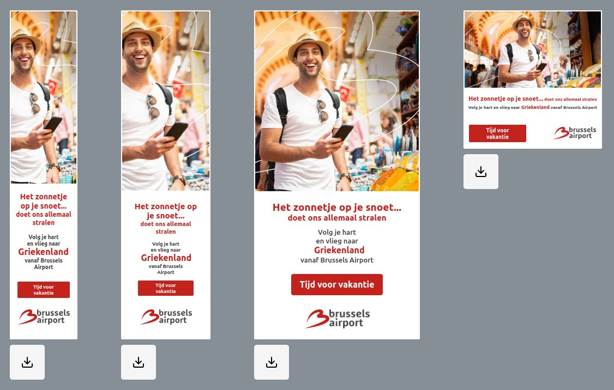

<br />
<div align="center">

<h3 align="center">Banner-Generator</h3>

  <p align="center">
    An application for generating and downloading banners
  </p>

<a style="font-size: 18px;" href="https://kimjacobus.github.io/banner-generator/">See the app live</a>
<br/>
<br/>



</div>

## About The Project

**A banner-generator application designed to effortlessly craft banners in various formats**,
made with a plethora of customization features and the possibility to either download them in zip folder or a single PNG file.

The **image component** has three layers made with a composition of mask, front and background layer in mind.

The **json functionality** allows you to add data directly into the text inputs. By entering the endpoint url into the JSON input, and wrapping your object key within the `` symbols, the same works for using the custom country input, add the `<country>` tag to choose where it should be placed and change the country name to your liking.

To illustrate the potential of this application, I've utilized the iconic Brussels Airport as a tangible and realistic example.

### Built With

[![React][React.js]][React-url]
[![Styled-Components][SC]][SC-url]
[![Vite][Vite]][Vite-url]
[![Prettier][Prettier]][Prettier-url]
[![ESlint][ESlint]][ESlint-url]

## Getting Started

Instruction for running the project locally.

### Prerequisites

- npm (or the package manager your prefer)

  ```sh
  npm install npm@latest -g
  ```

### Installation

1. Clone the repo
   ```sh
   git clone https://github.com/KimJacobus/banner-generator.git
   ```
2. Cd into the folder that has the package.json file then install the NPM packages
   ```sh
   npm install
   ```
3. Run the local server
   ```sh
   npm run dev
   ```

## Dependencies used

- [jszip](https://stuk.github.io/jszip/)
- [html-to-image](https://github.com/bubkoo/html-to-image#readme)
- [gh-pages](https://github.com/tschaub/gh-pages)

## Contact

jacobus.kim@gmail.com

<p align="right">(<a href="#readme-top">back to top</a>)</p>

[React.js]: https://img.shields.io/badge/React-20232A?style=for-the-badge&logo=react&logoColor=61DAFB
[React-url]: https://reactjs.org/
[Vite]: https://img.shields.io/badge/Vite-20232A?style=for-the-badge&logo=vite&logoColor=c061cb
[Vite-url]: https://vitejs.dev/
[SC]: https://img.shields.io/badge/StyledComponents-20232A?style=for-the-badge&logo=styledcomponents&logoColor
[SC-url]: https://styled-components.com/
[Prettier]: https://img.shields.io/badge/prettier-20232A?style=for-the-badge&logo=prettier&logoColor
[Prettier-url]: https://prettier.io/
[ESlint]: https://img.shields.io/badge/eslint-20232A?style=for-the-badge&logo=eslint&logoColor
[ESlint-url]: https://eslint.org/1
